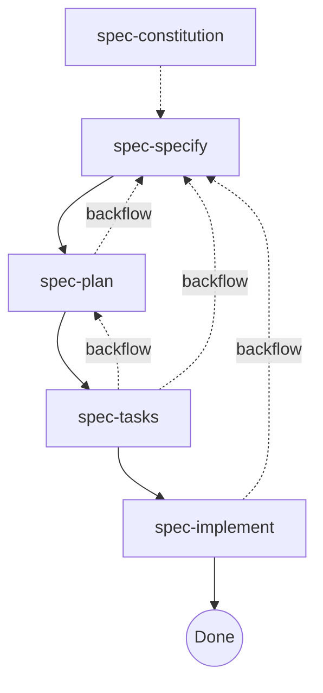

# spec-skills

[Agent Skills](https://agentskills.io) for Spec-Driven Development — agent-native, lightweight, and less ceremony.

## Install

```sh
npx skills add h3y6e/spec-skills -s '*'
```

## Workflow



## Skills

| Skill                                                  | Description                                                       |
| ------------------------------------------------------ | ----------------------------------------------------------------- |
| [`spec-constitution`](./skills/spec-constitution/SKILL.md)  | Define shared project rules for spec-skills runs                  |
| [`spec-specify`](./skills/spec-specify/SKILL.md)            | Create a feature specification and resolve ambiguity in one flow  |
| [`spec-plan`](./skills/spec-plan/SKILL.md)                  | Create a technical plan and manage annotation-driven updates      |
| [`spec-tasks`](./skills/spec-tasks/SKILL.md)                | Break spec and plan into executable phase-based tasks             |
| [`spec-implement`](./skills/spec-implement/SKILL.md)        | Execute tasks and maintain quality through a self-validation loop |

## Related

- [speckit-skills](https://github.com/h3y6e/speckit-skills): [github/spec-kit](https://github.com/github/spec-kit) workflow ported to Agent Skills

## License

[MIT](LICENSE)
