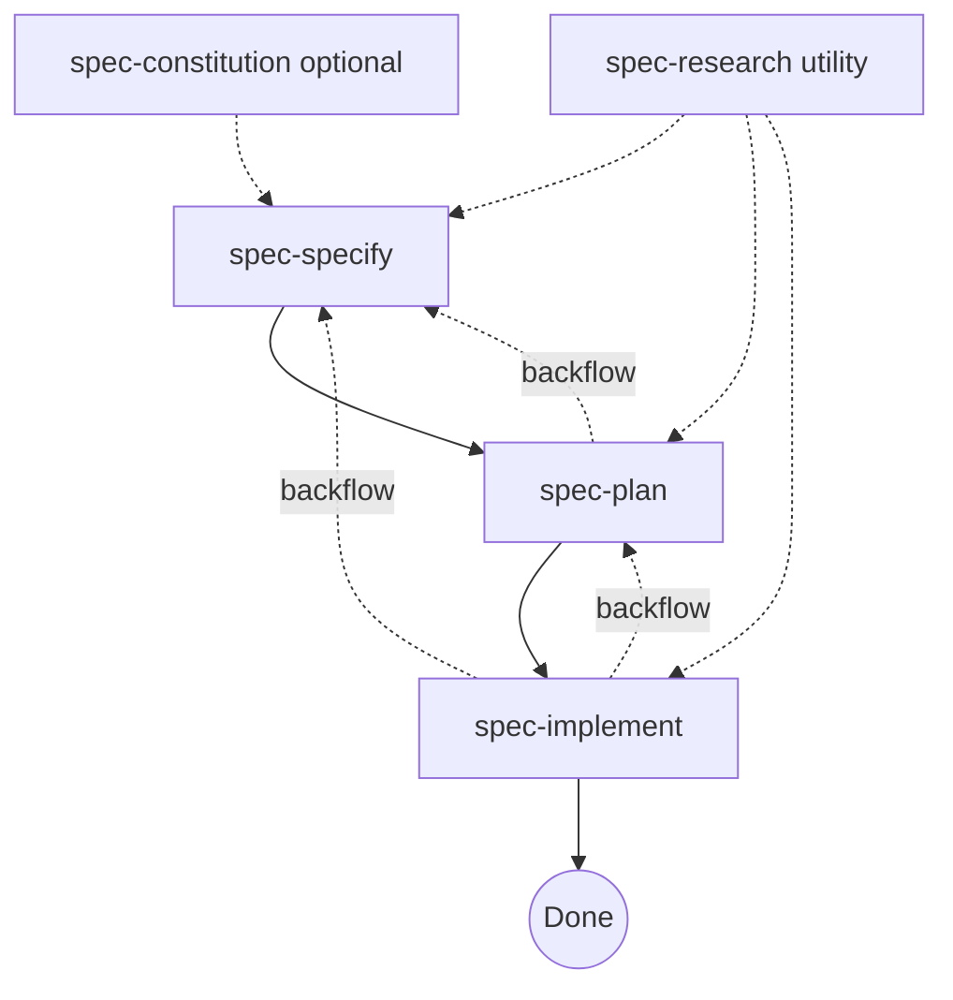

# spec-skills

[Agent Skills](https://agentskills.io) for Spec-Driven Development — agent-native, lightweight, and less ceremony.

## Install

```sh
npx skills add h3y6e/spec-skills -s '*'
```

## Workflow

The workflow is `0-3`: `spec-constitution` is optional step `0`, and teams that do not need shared workflow rules can start directly with step `1` (`spec-specify`). `spec-research` is a utility skill that can be invoked from any point in the workflow.


```mermaid
flowchart TD
    A["spec-constitution optional"] -.-> B["spec-specify"] --> C["spec-plan"] --> D["spec-implement"]
    D --> E((Done))
    R["spec-research utility"] -.-> B
    R -.-> C
    R -.-> D
    C -.->|backflow| B
    D -.->|backflow| C
    D -.->|backflow| B
```

## Skills

| Skill                                                  | Description                                                       |
| ------------------------------------------------------ | ----------------------------------------------------------------- |
| [`spec-constitution`](./skills/spec-constitution/SKILL.md)  | Optionally define shared project rules for spec-skills runs       |
| [`spec-specify`](./skills/spec-specify/SKILL.md)            | Create a feature specification and resolve ambiguity in one flow  |
| [`spec-research`](./skills/spec-research/SKILL.md)          | Investigate a topic and record findings with decision and impact  |
| [`spec-plan`](./skills/spec-plan/SKILL.md)                  | Turn a spec into one execution-ready document with decisions, phased tasks, and DoD |
| [`spec-implement`](./skills/spec-implement/SKILL.md)        | Execute tasks and maintain quality through a self-validation loop |

## Related

- [speckit-skills](https://github.com/h3y6e/speckit-skills): [github/spec-kit](https://github.com/github/spec-kit) workflow ported to Agent Skills

## License

[MIT](LICENSE)
